# Práctica 3 — Diseño de Arquitectura

Sistema de procesamiento de transacciones bancarias basado en microservicios.

## 1. Diagrama de Arquitectura General del Sistema

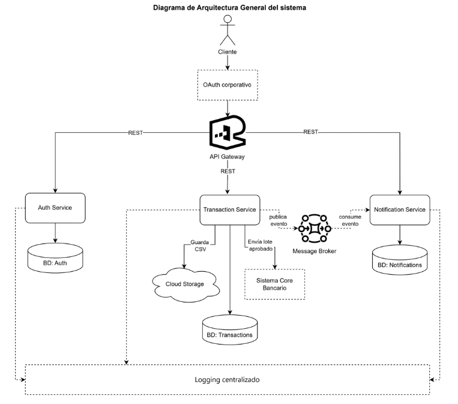

El sistema reemplaza el esquema monolítico actual por una arquitectura de microservicios. El cliente autentica primero contra el **OAuth corporativo** (token de 12 horas), pasa por un **API Gateway** como único punto de entrada, y de ahí se enruta hacia los tres microservicios. Cada microservicio tiene su propia base de datos independiente. `Transaction Service` es el núcleo del flujo de negocio: guarda los CSV en Cloud Storage, envía los lotes aprobados al Sistema Core Bancario externo, y publica eventos hacia `Notification Service` a través de un Message Broker. Los tres microservicios envían logs a un stack de logging centralizado.

## 2. Uso e Integración del Servicio de Autenticación de la Práctica 2

El `Auth Service` reutiliza el módulo implementado en la Práctica 2: JWT almacenado en cookie HTTP-only, con tiempo de vida y renovación automática configurables por variable de entorno, datos sensibles encriptados con AES-256-CBC, y autorización por rol validada contra un microservicio de autorización independiente (`authz-service`) mediante un mecanismo de reintentos con backoff configurable.

Para esta práctica, el esquema de roles se extiende de `admin`/`cliente` a los cuatro roles que requiere el flujo de aprobación bancario: `admin`, `maker`, `checker`, `authorizer`.

La integración con el **OAuth corporativo** que pide el enunciado funciona como una capa adicional: OAuth resuelve la identidad corporativa del usuario (SSO, token de 12h) y el `Auth Service` de la Práctica 2 se encarga de emitir la sesión de aplicación y resolver los permisos granulares por rol dentro del sistema de transacciones. Ambos mecanismos son complementarios, no redundantes: OAuth responde "¿quién eres a nivel de la organización?" y Auth Service responde "¿qué puedes hacer dentro de esta aplicación?".

## 3. Diseño de Microservicios

El sistema se divide en 3 microservicios, cada uno con responsabilidad única y base de datos propia:

| Microservicio | Responsabilidad |
|---|---|
| **Auth Service** | Autenticación, gestión de sesión y autorización por rol (heredado de la Práctica 2) |
| **Transaction Service** | Carga y validación de CSV, flujo de aprobación de 3 pasos, envío al core bancario, historial consultable |
| **Notification Service** | Envío de correos a los beneficiarios cuando un lote es aprobado |

El **logging centralizado** se implementa como infraestructura transversal (no como un cuarto microservicio), ya que no es lógica de negocio propia sino una capacidad de plataforma compartida por los tres servicios.

## 4. Diagrama de Componentes UML

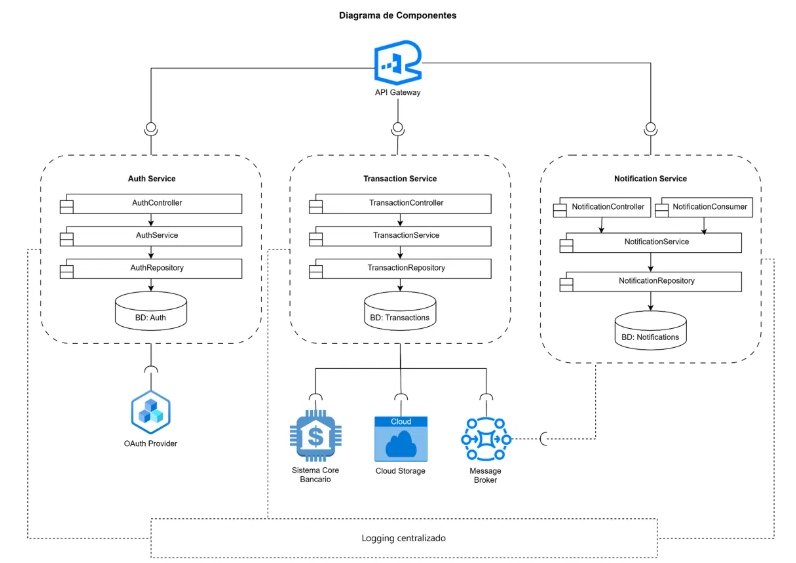

Cada microservicio se representa como un límite (boundary) independiente y cerrado, con su propia cadena interna `Controller → Service → Repository → Base de Datos`. Ningún componente interno de un microservicio se conecta directamente con el interior de otro: la única comunicación entre servicios ocurre a través del API Gateway (síncrona) o del Message Broker (asíncrona). Las conexiones hacia sistemas externos (OAuth Provider, Sistema Core Bancario, Cloud Storage, Message Broker) usan notación de interfaz UML: **lollipop** (círculo) del lado de quien ofrece la interfaz, **socket** (media luna) del lado de quien la consume.

## 5. Diagramas ER por Microservicio

**Auth Service**

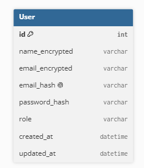

**Transaction Service**

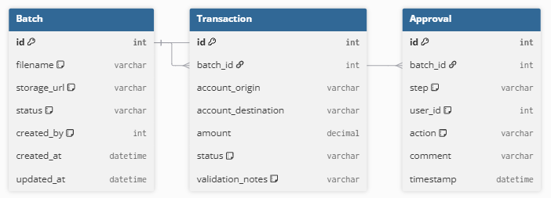

**Notification Service**

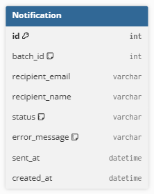

Cada microservicio tiene su base de datos independiente, sin llaves foráneas entre servicios distintos. Las referencias cruzadas (por ejemplo, `Notification.batch_id` hacia `Batch` de Transaction Service) son lógicas, no relaciones formales de base de datos, ya que cada servicio administra su propio esquema.

## 6. Diagramas de Clases UML por Microservicio

**Auth Service**

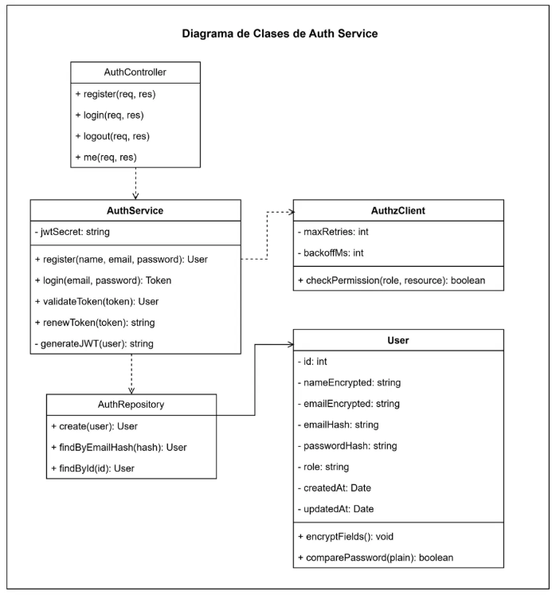

**Transaction Service**

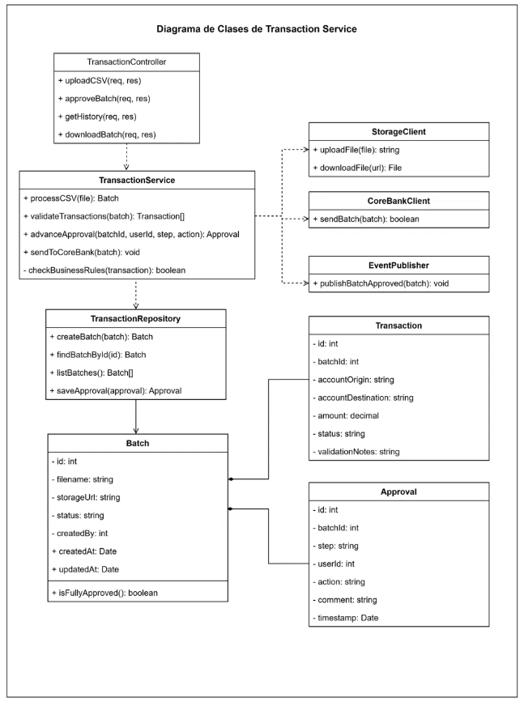

**Notification Service**

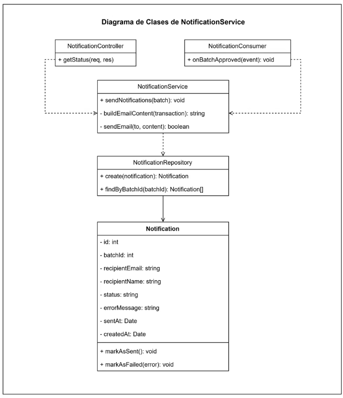

Las clases siguen el patrón Controller-Service-Repository en los tres microservicios. En Transaction Service, `Batch` tiene una relación de **composición** con `Transaction` y `Approval` (rombo relleno), ya que ninguna transacción ni aprobación puede existir sin su lote. En Notification Service, `NotificationController` y `NotificationConsumer` son dos puntos de entrada independientes y paralelos que convergen en `NotificationService`, no una cadena de llamadas entre sí.

## 7. Diagramas de Secuencia UML — Flujos Críticos

**Aprobación de transacciones de 3 pasos**

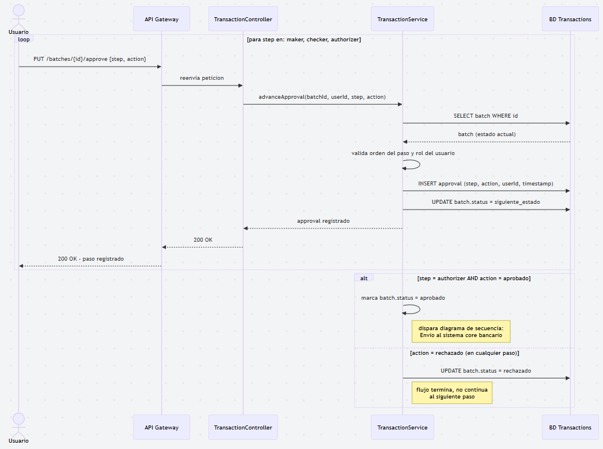

**Envío al sistema core bancario**

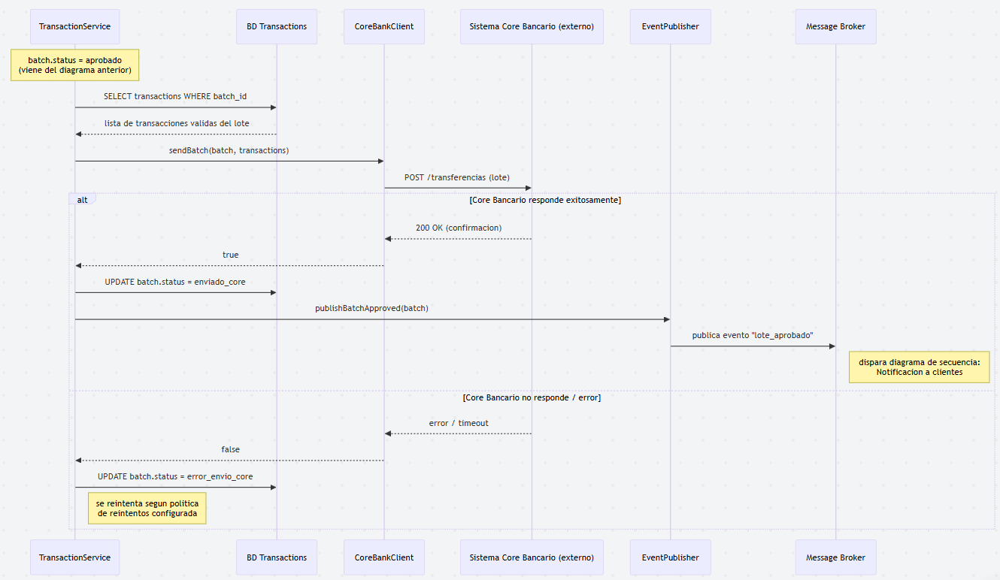

**Notificación a clientes**

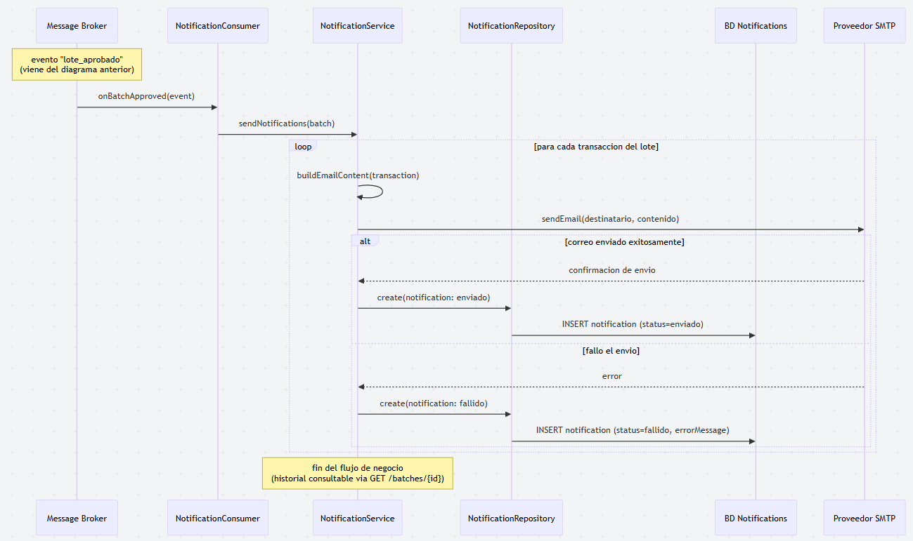

Los tres diagramas son continuos: el primero termina cuando `batch.status = aprobado`, lo cual dispara el segundo; el segundo termina publicando el evento `lote_aprobado` en el Message Broker, lo cual dispara el tercero.

## 8. Flujo de Aprobación de 3 Pasos (Maker-Checker-Authorizer)

El flujo sigue el esquema maker-checker-authorizer exigido por el enunciado:

1. **Maker**: usuario con rol `maker` revisa el lote recién cargado y lo marca como revisado. Cambia el estado de `registrado` a `en_revision_checker`.
2. **Checker**: usuario con rol `checker` verifica el trabajo del maker. Cambia el estado a `en_revision_authorizer`.
3. **Authorizer**: usuario con rol `authorizer` da la aprobación final. Si aprueba, el estado cambia a `aprobado` y se dispara el envío al sistema core bancario. Si cualquiera de los tres roles rechaza en su paso, el estado cambia a `rechazado` y el flujo termina ahí, sin avanzar al siguiente paso.

Cada paso queda registrado como una fila independiente en la entidad `Approval` (quién, qué rol, qué acción, cuándo), lo que permite auditar el historial completo de aprobación de cada lote.

## 9. Reglas de Validación del Negocio

Antes de que una transacción individual quede como `valida` dentro de un lote, `TransactionService` la somete a las siguientes reglas de negocio (método `checkBusinessRules()`):

- **Saldo disponible**: la cuenta de origen debe tener fondos suficientes para cubrir el monto de la transacción.
- **Límites de transacción**: el monto no debe superar el límite configurado para el tipo de cuenta o cliente.
- **Cuentas válidas**: tanto la cuenta de origen como la de destino deben existir y estar activas.
- **Prevención de fraude**: se valida contra reglas básicas de fraude (por ejemplo, montos atípicos o cuentas marcadas).

Si una transacción no pasa alguna de estas reglas, su estado queda como `rechazada_por_regla` y el motivo se guarda en `validation_notes`, la transacción no avanza al flujo de aprobación de 3 pasos, pero el resto del lote sí puede continuar.

Además de la validación de transacciones, la arquitectura refleja dos reglas de negocio adicionales exigidas por el enunciado:

- **Historial consultable**: todo lote procesado (aprobado, rechazado o en curso) queda almacenado en `Batch` con su contenido y la referencia a `storage_url`, permitiendo consultarlo y descargarlo en cualquier momento vía `TransactionController.getHistory()` / `downloadBatch()`.
- **Logging auditable**: cada acción relevante de los 3 microservicios se envía al stack de logging centralizado (ver sección 11), cumpliendo el requerimiento de que el sistema sea auditable de punta a punta.

## 10. Estrategia de Almacenamiento de Archivos CSV

Los archivos CSV cargados por el usuario se suben a **Cloud Storage** (AWS S3, GCP o equivalente) a través del componente `StorageClient` de `Transaction Service`. La base de datos no almacena el archivo en sí, solo la referencia (`storage_url`) dentro de la entidad `Batch`. Esto evita sobrecargar la base de datos relacional con archivos binarios y permite reutilizar la URL para la opción de descarga del historial que exige el enunciado.

## 11. Estrategia de Logging Centralizado

Los tres microservicios emiten logs estructurados hacia un stack de logging centralizado (tipo ELK o Grafana Loki), representado como infraestructura transversal en el diagrama de arquitectura. Esto permite auditar todo lo que ocurre en el sistema desde un solo punto de consulta, sin que cada microservicio dependa del almacenamiento de logs de otro. La conexión hacia el logging es asíncrona y de tipo "fire and forget": ningún servicio espera confirmación del logging para continuar su flujo normal.

## 12. Comunicación entre Servicios

- **REST (síncrono)**: usado entre el API Gateway y cada microservicio, para operaciones que requieren respuesta inmediata (login, carga de CSV, consulta de historial, aprobación de un paso).
- **Mensajería asíncrona (Message Broker)**: usada exclusivamente entre `Transaction Service` y `Notification Service`, para el evento de lote aprobado. Se eligió asíncrono aquí porque enviar decenas o cientos de correos no debe bloquear la respuesta al usuario que aprobó el lote.

## 13. Propuesta de API Gateway

El API Gateway es el único punto de entrada del sistema. Sus responsabilidades:

- Enrutar cada petición al microservicio correspondiente.
- Validar que la petición incluya un token OAuth corporativo vigente antes de reenviarla.
- Actuar como capa de desacople entre el cliente y la topología interna de microservicios (el cliente nunca conoce las URLs internas de cada servicio).

`Notification Service` no recibe tráfico del Gateway, ya que su única entrada es el evento del Message Broker; esto se documenta explícitamente en el diagrama de componentes.

## 14. Tecnologías y Patrones de Diseño

**Tecnologías**

| Componente | Tecnología | Justificación |
|---|---|---|
| Microservicios | Node.js + Express | Consistente con el stack ya usado en la Práctica 2, ligero para APIs REST |
| Base de datos | Relacional (MySQL/PostgreSQL), una por microservicio | Los datos de cada servicio son estructurados y requieren integridad transaccional (ACID), especialmente en `Transaction Service` |
| Message Broker | RabbitMQ | Soporta el patrón publicador/consumidor requerido para desacoplar `Transaction Service` de `Notification Service`, con colas duraderas si el consumidor está caído |
| Almacenamiento de archivos | Cloud Storage (AWS S3 o equivalente) | Óptimo para archivos binarios/CSV, evita sobrecargar la base de datos relacional |
| Logging | ELK / Grafana Loki | Permiten consulta centralizada y auditable de logs de múltiples servicios |

**Patrones de diseño**

- **Repository**: cada microservicio aísla su acceso a datos en una clase `Repository`, separando la lógica de negocio (`Service`) de la persistencia.
- **Adapter**: `CoreBankClient` y `StorageClient` encapsulan la comunicación con sistemas externos (Sistema Core Bancario, Cloud Storage) detrás de una interfaz propia, para que `TransactionService` no dependa directamente de la API de terceros.
- **Publisher/Subscriber**: `EventPublisher` y `NotificationConsumer` implementan este patrón sobre el Message Broker, desacoplando a `Transaction Service` de `Notification Service`,  ninguno conoce al otro directamente.
- **API Gateway**: centraliza el enrutamiento y la validación de autenticación, evitando que el cliente conozca la topología interna de microservicios.
- **Retry with backoff**: usado tanto en la comunicación de `Auth Service` con `authz-service` (heredado de la Práctica 2) como recomendado para `CoreBankClient` ante fallas temporales de comunicación con el Sistema Core Bancario.