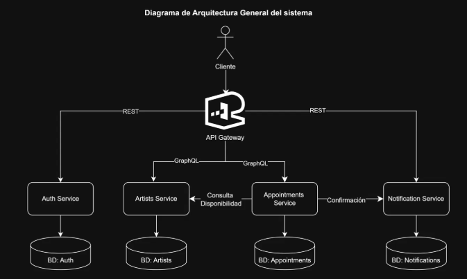
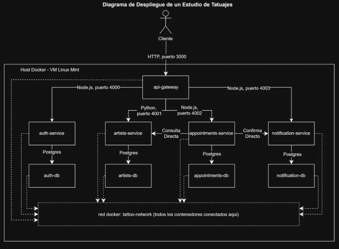
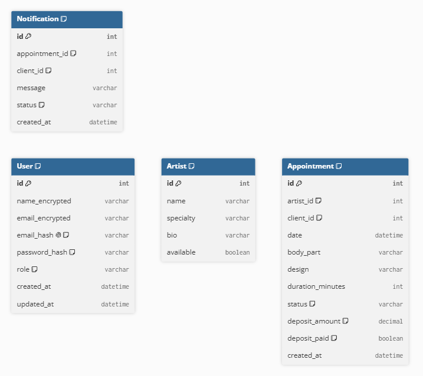

# Práctica 4 — Diseño y Toma de Decisiones

Sistema de gestión de citas para un estudio de tatuajes, basado en microservicios, contenedorizado con Docker, con autenticación heredada de la Práctica 2.

## 1. Descripción general del sistema

El sistema permite a un cliente registrarse, iniciar sesión, consultar el catálogo de tatuadores disponibles y agendar una cita, la cual dispara una notificación automática al cliente. Está compuesto por 4 microservicios independientes, cada uno con su propia base de datos PostgreSQL, expuestos a través de un único API Gateway.

## 2. Diagrama de Arquitectura General



El cliente se conecta únicamente al API Gateway, que enruta cada petición hacia el microservicio correspondiente (REST para Auth y Notification, GraphQL para Artists y Appointments). `Appointments Service` se comunica de forma directa con `Artists Service` (para consultar disponibilidad del artista) y con `Notification Service` (para avisar que una cita quedó registrada), sin pasar por el Gateway — esta es la comunicación directa entre microservicios que el enunciado permite como punto adicional.

## 3. Microservicios y tecnologías

| Microservicio | Lenguaje | Protocolo | Puerto | Base de datos |
|---|---|---|---|---|
| Auth Service | Node.js + Express | REST | 4000 | auth-db (PostgreSQL) |
| Artists Service | Python + FastAPI | GraphQL | 4001 | artists-db (PostgreSQL) |
| Appointments Service | Node.js + Express | GraphQL | 4002 | appointments-db (PostgreSQL) |
| Notification Service | Node.js + Express | REST | 4003 | notification-db (PostgreSQL) |
| API Gateway | Node.js + Express | REST/GraphQL (proxy) | 3000 | — |

Se cumple el requerimiento de al menos 2 lenguajes distintos (Node.js y Python) y GraphQL implementado en al menos 2 servicios (Artists y Appointments).

## 4. Integración con la autenticación de la Práctica 2

`Auth Service` reutiliza el módulo desarrollado en la Práctica 2: JWT almacenado en cookie HTTP-only, datos sensibles (nombre y correo) encriptados con AES-256-CBC, y un hash HMAC-SHA256 del correo para poder buscar en el login sin desencriptar toda la tabla. Los roles se ajustaron al contexto de esta práctica: `admin`, `artist`, `client`.

El API Gateway centraliza la validación de sesión: antes de reenviar una petición hacia `Appointments Service` o `Notification Service`, llama al endpoint interno `POST /api/auth/verify` de Auth Service. Si el token es válido, agrega el `id` y el `role` del usuario como headers (`x-user-id`, `x-user-role`) a la petición reenviada, de forma que los demás microservicios no necesitan repetir la lógica de JWT — solo confían en lo que el Gateway ya validó.

## 5. Comunicación entre servicios

| Tipo | Uso |
|---|---|
| REST vía Gateway | Cliente hacia Auth Service y Notification Service |
| GraphQL vía Gateway | Cliente hacia Artists Service y Appointments Service |
| REST directo (sin Gateway) | Appointments Service → Artists Service (consulta disponibilidad) |
| REST directo (sin Gateway) | Appointments Service → Notification Service (confirma cita creada) |

Las llamadas directas se implementan con `fetch` nativo de Node.js, usando las URLs internas de Docker (por ejemplo `http://artists-service:4001`), posibles porque todos los contenedores comparten la misma red de Docker (`tattoo-network`).

### 5.1 Validación de disponibilidad en dos niveles

Al crear una cita, `Appointments Service` valida la disponibilidad del artista en dos niveles distintos, complementarios entre sí:

1. **Disponibilidad general** (consulta directa a Artists Service): revisa el campo `available` del artista, que indica si está aceptando citas nuevas en este momento.
2. **Choque de horario** (validación interna, dentro de la propia base de datos de Appointments Service): revisa si el artista ya tiene otra cita activa (`status != 'cancelada'`) cuyo rango de fecha/hora se traslape con el de la nueva cita, usando `date` y `duration_minutes` de cada registro. Si hay traslape, la cita se rechaza con un error explícito, sin necesidad de agregar ningún campo ni tabla nueva.

Este segundo nivel no requirió cambios al modelo de datos ni a los diagramas ER o de arquitectura, ya que reutiliza campos que la entidad `Appointment` ya tenía.

### 5.2 Confirmación de citas mediante anticipo

En un estudio de tatuajes real, una cita no queda agendada en firme solo por registrarse: se requiere que el cliente pague un anticipo. Por esto, la entidad `Appointment` incluye dos campos adicionales: `deposit_amount` (monto pagado) y `deposit_paid` (si el anticipo ya se registró), y el campo `status` refleja directamente este flujo en vez de usar nombres genéricos:

| Estado | Significado |
|---|---|
| `pendiente_anticipo` | La cita se registró, pero el cliente todavía no ha pagado el anticipo |
| `agendada` | El anticipo ya se pagó, la cita queda confirmada en firme |
| `completada` | El servicio ya se realizó |
| `cancelada` | La cita se canceló |

- Una cita nueva siempre inicia en `pendiente_anticipo`, con `deposit_paid = false`.
- El estado `agendada` **no puede asignarse manualmente** a través de `updateAppointmentStatus` — esa mutation lo rechaza explícitamente. La única forma de que una cita pase a `agendada` es a través de la mutation `registerDeposit(id, amount)`, que registra el anticipo y actualiza el estado en la misma operación.
- Esto convierte una regla de negocio real (el estudio no reserva el espacio sin garantía de pago) en una restricción aplicada a nivel de código, no solo documentada, y el propio nombre del estado comunica en qué parte del flujo de pago se encuentra la cita.

## 6. Diagrama de Despliegue



Todos los contenedores corren dentro de un mismo host Docker (una VM con Linux Mint). Solo el `api-gateway` expone su puerto (3000) hacia afuera del host; los demás microservicios y sus bases de datos solo son alcanzables dentro de la red interna `tattoo-network`.

## 7. Diagrama ER



Se presenta como un diagrama único con las 4 entidades (una por cada base de datos), dado que la sección de Alcance del enunciado solicita el "Diagrama ER completo de las bases de datos" en singular. No existen llaves foráneas reales entre entidades de distintos microservicios (por ejemplo, `Appointment.artist_id` no es una FK hacia `Artist.id`), ya que cada base de datos es independiente; esas relaciones son lógicas y se documentan como notas en cada campo.

**Nota:** la entidad `Appointment` incluye dos campos adicionales respecto a la versión inicial del diseño: `deposit_amount` (decimal, monto del anticipo) y `deposit_paid` (boolean, si el anticipo fue pagado), agregados para reflejar la regla de negocio de confirmación por anticipo descrita en la sección 5.2.

## 8. GraphQL

Implementado en dos servicios, usando un esquema SDL (Schema Definition Language):

- **Artists Service** (Python, librería Strawberry): queries `artists`, `artist(id)`; mutations `createArtist`, `setAvailability`.
- **Appointments Service** (Node.js, librería express-graphql): queries `appointments`, `appointment(id)`; mutations `createAppointment`, `updateAppointmentStatus`.

Se eligió GraphQL para estos dos servicios porque ambos exponen datos con forma variable según el consumidor (el catálogo de artistas y el detalle de una cita pueden necesitar distintos subconjuntos de campos), mientras que Auth y Notification exponen operaciones más fijas y puntuales, para las que REST es suficiente.

## 9. Docker y Docker Compose

Cada microservicio tiene su propio `Dockerfile`. El archivo `docker-compose.yml` en la raíz de `P4/` levanta los 9 contenedores (4 microservicios + 4 bases de datos + API Gateway) con un solo comando:

```bash
docker compose up --build
```

Todos los contenedores se conectan a una red interna común (`tattoo-network`), y cada base de datos persiste sus datos en un volumen de Docker independiente.

## 10. Contrato de Microservicios

El archivo `contrato-postman.json` contiene una Collection de Postman con los 12 endpoints del sistema, organizados por microservicio, probados y funcionando de extremo a extremo (incluyendo el flujo completo: registro, login, creación de artista, creación de cita con validación de disponibilidad, y notificación automática).

## 11. Principios SOLID aplicados

- **Responsabilidad única (S)**: cada capa tiene una sola razón para cambiar — `Controller` solo maneja HTTP, `Service` solo contiene lógica de negocio, `Repository` solo accede a datos. Ejemplo: `appointments-service/src/resolvers/resolvers.js` no contiene SQL directo, delega en `Appointment.js`.
- **Abierto/cerrado (O)**: agregar un nuevo campo de validación en `TransactionService`/`AppointmentService` no requiere modificar el `Controller` ni el `Repository`, solo la función de negocio correspondiente.
- **Sustitución de Liskov (L)**: no aplica una jerarquía de clases compleja en este proyecto (se usan funciones y módulos en vez de herencia), por lo que este principio se refleja en que cualquier implementación de `Repository` (por ejemplo, cambiar de PostgreSQL a otra base) podría sustituirse sin alterar el `Service` que la consume, mientras respete la misma interfaz de funciones.
- **Segregación de interfaces (I)**: cada microservicio expone solo los endpoints/queries que sus consumidores necesitan; por ejemplo, `Notification Service` no expone operaciones de escritura masiva innecesarias para el resto del sistema.
- **Inversión de dependencias (D)**: `Appointments Service` no depende de los detalles internos de `Artists Service` ni `Notification Service`, solo de su contrato HTTP/GraphQL expuesto (URLs configurables por variable de entorno `ARTISTS_SERVICE_URL`, `NOTIFICATION_SERVICE_URL`), lo que permite cambiar la implementación interna de esos servicios sin afectar a Appointments.

## 12. Estructura del repositorio

```
P4/
├── README.md
├── docker-compose.yml
├── contrato-postman.json
├── Imagenes/
│   ├── arquitectura.png
│   ├── despliegue.png
│   └── er.png
├── api-gateway/
├── auth-service/
├── artists-service/
├── appointments-service/
└── notification-service/
```