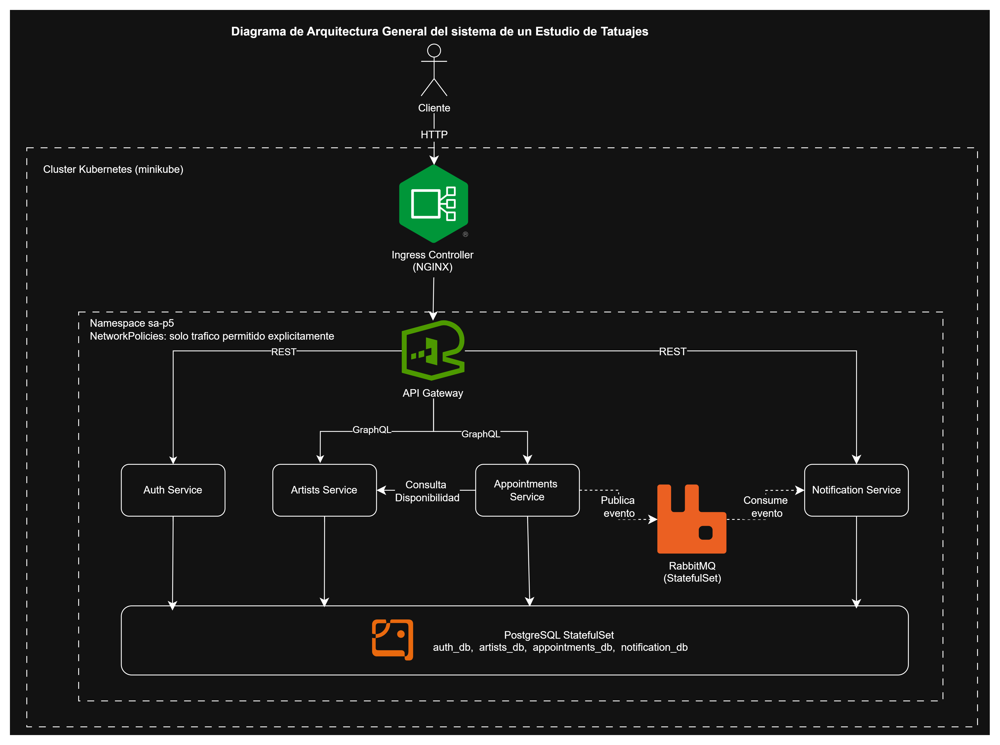
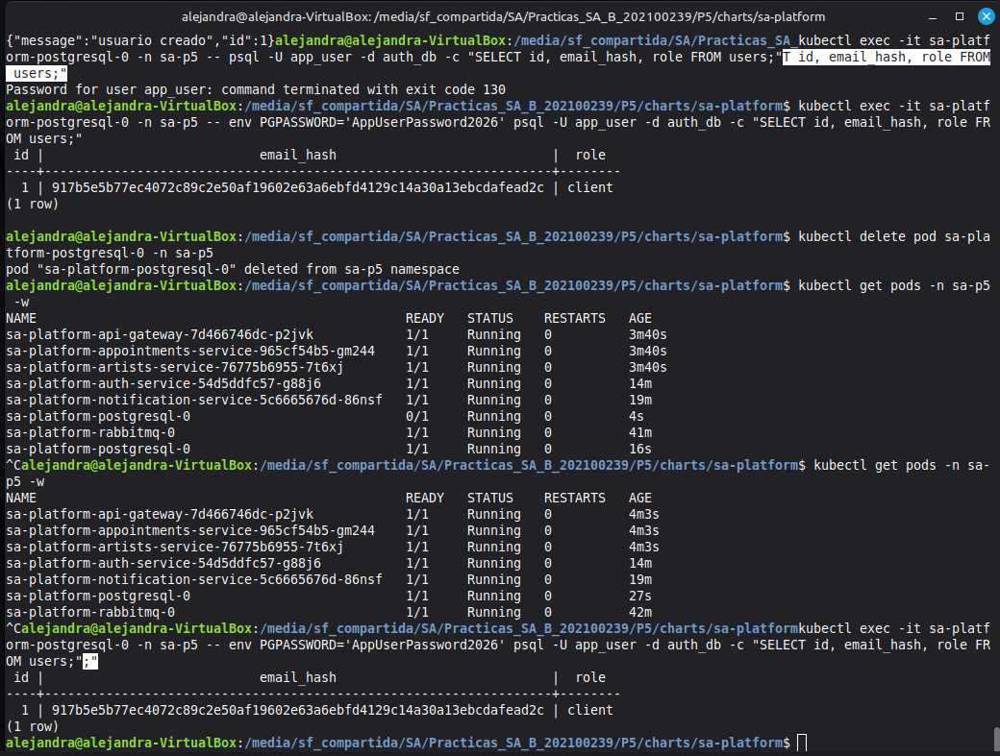
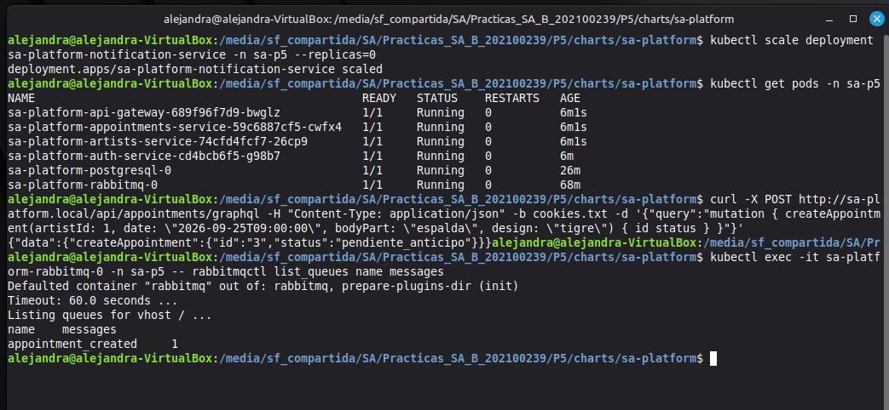
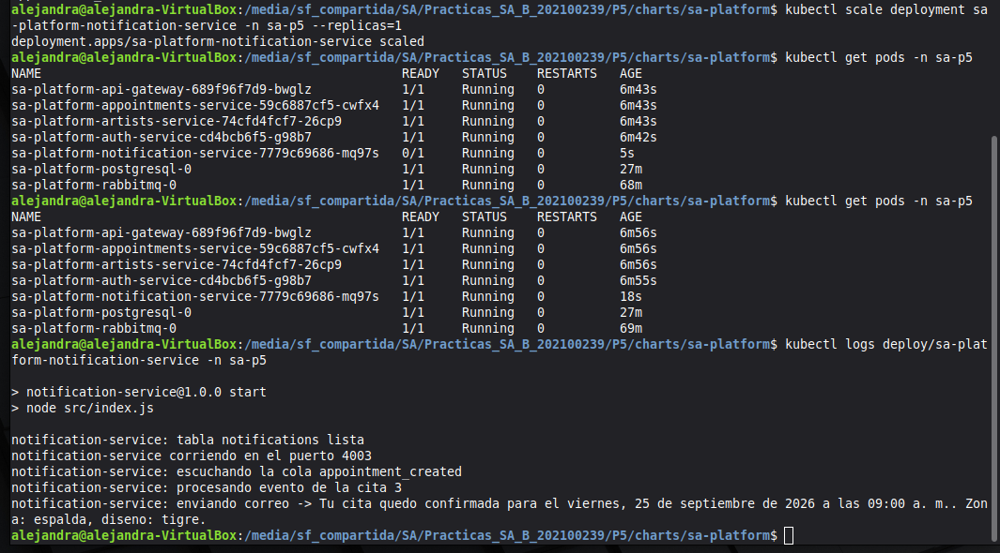
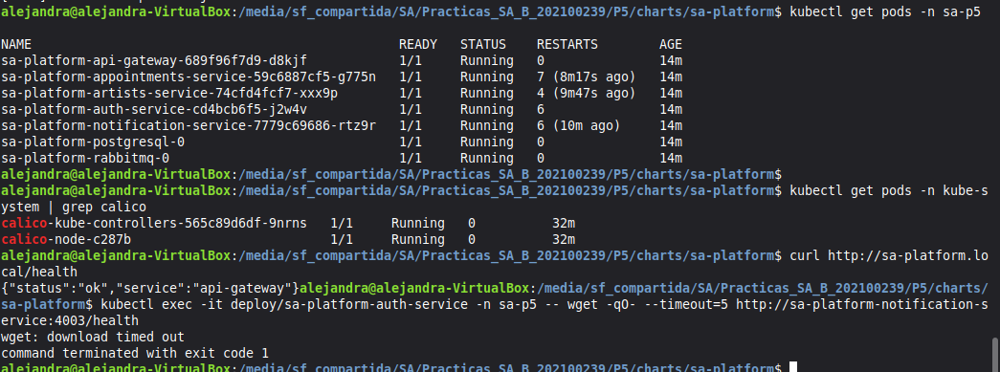
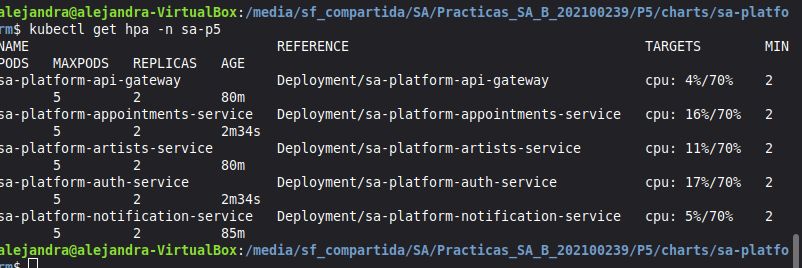
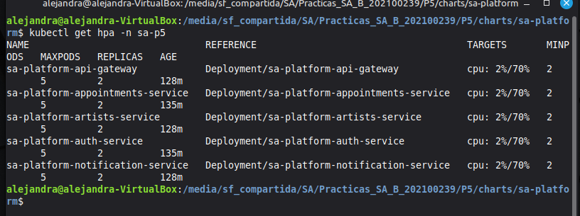

# Practica 5 - Orquestacion avanzada de microservicios en Kubernetes con Helm

Esta practica lleva el sistema de la Practica 4 (estudio de tatuajes, 4 microservicios + api gateway) a un cluster de Kubernetes local (minikube), empaquetado como un chart de Helm padre con subcharts, comunicacion asincrona real via RabbitMQ, persistencia con PostgreSQL, seguridad restrictiva, escalado automatico y dos cronjobs encadenados.

## 1. Diagrama de arquitectura

Muestra el cliente entrando por el Ingress Controller (fuera del namespace `sa-p5`), el api gateway como unico punto de entrada dentro del namespace protegido por NetworkPolicies, los 4 microservicios, la comunicacion asincrona via RabbitMQ hacia notification-service, y la unica instancia de PostgreSQL con las bases de datos logicas separadas.



## 2. Comandos reproducibles (de cluster vacio a sistema funcionando)

### 2.1 Herramientas necesarias
```bash
# kubectl
curl -LO "https://dl.k8s.io/release/$(curl -L -s https://dl.k8s.io/release/stable.txt)/bin/linux/amd64/kubectl"
sudo install -o root -g root -m 0755 kubectl /usr/local/bin/kubectl

# minikube
curl -LO https://storage.googleapis.com/minikube/releases/latest/minikube-linux-amd64
sudo install minikube-linux-amd64 /usr/local/bin/minikube

# helm
curl https://raw.githubusercontent.com/helm/helm/main/scripts/get-helm-3 | bash

# k6 (para la prueba de carga)
curl https://github.com/grafana/k6/releases/download/v0.54.0/k6-v0.54.0-linux-amd64.tar.gz -L | tar xz --strip-components 1
sudo mv k6 /usr/local/bin/
```

### 2.2 Levantar el cluster
Se usa Calico como CNI en vez del driver por defecto de minikube, porque el driver por defecto no hace cumplir las NetworkPolicies.

```bash
minikube start --driver=docker --cpus=2 --memory=4096 --cni=calico
minikube addons enable ingress
minikube addons enable metrics-server
```

Agregar al `/etc/hosts` (la IP la da `minikube ip`):
```
192.168.49.2 sa-platform.local
```

### 2.3 Construir las imagenes dentro de minikube
```bash
eval $(minikube docker-env)

cd P4
docker build -t auth-service:1.0 ./auth-service
docker build -t artists-service:1.0 ./artists-service
docker build -t appointments-service:1.0 ./appointments-service
docker build -t notification-service:1.0 ./notification-service
docker build -t api-gateway:1.0 ./api-gateway

cd ../P5/cronjobs
docker build -t cronjobs:1.0 .
```

### 2.4 Resolver dependencias del chart e instalar
```bash
cd P5/charts/sa-platform
helm repo add bitnami https://charts.bitnami.com/bitnami
helm dependency update
helm install sa-platform . -f values.yaml -f values-secrets.yaml --create-namespace --namespace sa-p5
```

Nota: `values-secrets.yaml` no esta en el repositorio (esta en `.gitignore`). Copiar `values.example.yaml`, renombrar a `values-secrets.yaml` y poner ahi las credenciales reales antes de instalar.

### 2.5 Crear la base de datos de los cronjobs (solo la primera vez)
El script de inicializacion de Postgres solo corre cuando el volumen se crea por primera vez, asi que si se reinstala sobre un volumen existente hay que crearla a mano:
```bash
kubectl exec -it sa-platform-postgresql-0 -n sa-p5 -- env PGPASSWORD='<password>' psql -U app_user -d postgres -c "CREATE DATABASE cronjobs_db;"
kubectl exec -it sa-platform-postgresql-0 -n sa-p5 -- env PGPASSWORD='<password>' psql -U app_user -d postgres -c "GRANT ALL PRIVILEGES ON DATABASE cronjobs_db TO app_user;"
```

### 2.6 Verificar
```bash
kubectl get pods -n sa-p5
kubectl get hpa -n sa-p5
kubectl get cronjob -n sa-p5
curl http://sa-platform.local/health
```

### 2.7 Actualizar (upgrade) y revertir (rollback)
```bash
helm upgrade sa-platform . -f values.yaml -f values-secrets.yaml --namespace sa-p5
helm history sa-platform -n sa-p5
helm rollback sa-platform <numero-de-revision> -n sa-p5
```

## 3. Prueba de carga

Script en `P5/loadtest/script.js`, ejecutado con:
```bash
k6 run script.js
```
Golpea `POST /api/artists/graphql` a traves del gateway, con concurrencia creciente hasta 50 usuarios simultaneos durante 4 minutos.

**Resultados obtenidos:**

| Metrica | Valor |
|---|---|
| Peticiones totales | 2097 |
| RPS promedio | 8.09 req/s |
| Latencia p90 | 5.67 s |
| Latencia p95 | 8.48 s |
| Tasa de error | 13.78% |

El uso de CPU de los microservicios se mantuvo entre 2% y 12% durante la prueba (por debajo del umbral del 70% configurado en el HPA), por lo que no se disparo un escalado automatico durante esta corrida especifica. La latencia alta bajo carga sugiere que el cuello de botella en este entorno de prueba (minikube local con recursos compartidos) no esta en el CPU de los microservicios sino en otra capa (probablemente la conexion a PostgreSQL o el Ingress Controller bajo las limitaciones del cluster local). El mecanismo de HPA en si se verifico funcionando correctamente de forma independiente (ver evidencias 7.5 y 7.6 mas abajo).

## 4. Tamaño de imagenes

Las imagenes se construyeron sobre bases minimas (`alpine` para Node.js, `slim` para Python) desde el inicio del proyecto:

| Imagen | Base usada | Tamaño final |
|---|---|---|
| auth-service | node:20-alpine | 156 MB |
| artists-service | python:3.12-slim | 221 MB |
| appointments-service | node:20-alpine | 150 MB |
| notification-service | node:20-alpine | 145 MB |
| api-gateway | node:20-alpine | 161 MB |

Como referencia, las mismas imagenes construidas sobre las bases completas (no optimizadas) `node:20` y `python:3.12` pesan aproximadamente 1.1 GB y 1 GB respectivamente segun Docker Hub, es decir, entre 5 y 7 veces mas grandes que las versiones usadas en este proyecto.

## 5. Seguridad aplicada

- Cada microservicio corre con su propio ServiceAccount (no usa `default`).
- Cada ServiceAccount tiene un Role de cero permisos sobre la API de Kubernetes (los microservicios no necesitan hablarle a la API), aplicando minimo privilegio real.
- `securityContext`: `runAsNonRoot: true`, `runAsUser: 1000`, `readOnlyRootFilesystem: true`, `allowPrivilegeEscalation: false`, `capabilities.drop: [ALL]` en los 5 microservicios y en los 2 cronjobs.
- Los Dockerfiles crean un usuario no root (`node` en las imagenes de Node.js, `appuser` creado a mano en la de Python) y transfieren la propiedad de `/app` antes de cambiar de usuario.
- Cada contenedor tiene un volumen `emptyDir` en memoria montado en `/tmp`, necesario porque el filesystem raiz es de solo lectura.

## 6. Comunicacion asincrona

`appointments-service` publica un evento a la cola durable `appointment_created` de RabbitMQ al crear una cita, sin esperar respuesta. `notification-service` consume esa cola de forma independiente y confirma (`ack`) solo despues de guardar la notificacion en su base de datos; si falla, el mensaje se reintenta (`nack` con requeue). Se demostro con evidencia que, si `notification-service` esta caido, los mensajes se acumulan en la cola sin perderse, y se procesan todos al restaurar el consumidor (ver evidencias 7.2 y 7.3).

El mismo patron se reutiliza para el resumen que publica el cronjob 2 (cola `cron_summary`), tambien consumida por `notification-service`.

## 7. Evidencias

### 7.1 Persistencia de datos

Se creo un usuario a traves del sistema, se confirmo que existia en la base de datos, se elimino el pod de PostgreSQL con `kubectl delete pod`, y una vez que el StatefulSet lo recreo desde cero se volvio a consultar el mismo registro. El usuario siguio existiendo con exactamente el mismo `email_hash`, lo que confirma que los datos viven en el PersistentVolumeClaim y no en el pod.



### 7.2 RabbitMQ - mensaje acumulado con el consumidor caido

Se escalo `notification-service` a 0 replicas, se creo una cita nueva (lo que genera un evento), y se confirmo con `rabbitmqctl list_queues` que el mensaje quedo esperando en la cola `appointment_created` sin nadie que lo procesara.



### 7.3 RabbitMQ - mensaje procesado al restaurar el consumidor

Se volvio a escalar `notification-service` a 1 replica. Apenas el pod quedo listo, proceso automaticamente el mensaje que se habia quedado pendiente, sin perder informacion.



### 7.4 NetworkPolicy - bloqueo de trafico no autorizado

Con Calico como CNI y las NetworkPolicies aplicadas, se intento una peticion desde `auth-service` directo hacia `notification-service` (una ruta que nunca deberia estar permitida segun el diseño). La peticion fallo por timeout, confirmando que el trafico lateral no autorizado esta bloqueado.



### 7.5 HPA con metricas reales

Los 5 HorizontalPodAutoscaler (uno por microservicio) reportando el porcentaje real de uso de CPU obtenido de metrics-server, con el rango configurado de 2 a 5 replicas.



### 7.6 HPA estable

Los mismos 5 HPA, ya con mas de dos horas de antiguedad y funcionando de forma consistente, luego de resolver una condicion de carrera detectada durante la instalacion (ver seccion de comandos reproducibles y notas del proyecto).



## 8. Preguntas teoricas

**Que es Helm y que problema resuelve frente a los manifiestos sueltos?**
Helm es un gestor de paquetes para Kubernetes. En vez de aplicar decenas de archivos YAML sueltos con `kubectl apply -f`, Helm los empaqueta en un chart parametrizable con `values.yaml`, y permite instalar, actualizar y revertir toda la plataforma con un solo comando y con historial de versiones.

**Diferencia entre chart, release y repository?**
Un chart es el paquete de plantillas (la definicion de que se va a desplegar). Un release es una instancia instalada de ese chart en un cluster, con un nombre y un namespace especificos (se puede instalar el mismo chart varias veces con distintos releases). Un repository es donde se publican y descargan charts, como el de Bitnami que usamos para PostgreSQL y RabbitMQ.

**Que es un StatefulSet y cuando NO usarlo?**
Un StatefulSet es un controlador para aplicaciones con estado, que da a cada pod una identidad estable (nombre y almacenamiento persistente que no cambia aunque el pod se reinicie), a diferencia de un Deployment donde los pods son intercambiables. No se debe usar para aplicaciones sin estado como nuestros microservicios (por eso ellos usan Deployment), porque un StatefulSet es mas lento de escalar y actualizar sin necesidad.

**Diferencia entre liveness, readiness y startup probe?**
La liveness revisa si el proceso sigue vivo; si falla, Kubernetes reinicia el contenedor. La readiness revisa si el contenedor ya puede recibir trafico; si falla, se saca temporalmente del Service sin reiniciarlo. La startup le da tiempo al contenedor de terminar de arrancar antes de que las otras dos probes empiecen a evaluarlo, util cuando la app tarda en conectarse a la base de datos.

**Que es una NetworkPolicy y por que el trafico es permitido por defecto?**
Es un recurso que define reglas de que trafico de red se permite entre pods. Por defecto Kubernetes permite todo el trafico entre pods sin restriccion, porque el modelo de red base esta pensado para conectividad total; las NetworkPolicies existen para que uno decida restringirlo explicitamente, y solo funcionan si el CNI del cluster las implementa (el driver por defecto de minikube no lo hace, por eso usamos Calico).

**Que es un PodDisruptionBudget?**
Define cuantos pods de una aplicacion pueden estar caidos al mismo tiempo durante una interrupcion voluntaria (por ejemplo, drenar un nodo para mantenimiento). En este proyecto cada microservicio tiene `minAvailable: 1`, para garantizar que siempre quede al menos un pod disponible aunque Kubernetes este moviendo el resto.

**Que ventajas y que nuevos problemas introduce la comunicacion asincrona?**
Ventaja principal: desacopla a los servicios, el productor no espera al consumidor y el sistema sigue funcionando aunque el consumidor este temporalmente caido (lo demostramos con RabbitMQ). Problemas nuevos: hay que manejar duplicados o reintentos (si un mensaje se procesa pero el ack falla), la consistencia deja de ser inmediata (eventual, no instantanea), y se vuelve mas dificil rastrear un flujo completo porque ya no es una sola llamada sincrona sino varios pasos independientes.

**Que hace `helm rollback` internamente?**
Helm guarda cada release aplicado como un Secret en el cluster (visible con `helm history`). `helm rollback` toma el manifiesto completo de una revision anterior y lo vuelve a aplicar contra el cluster, regresando todos los recursos (Deployments, ConfigMaps, etc.) al estado exacto que tenian en esa revision.