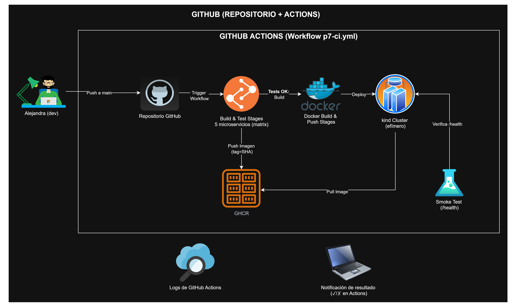
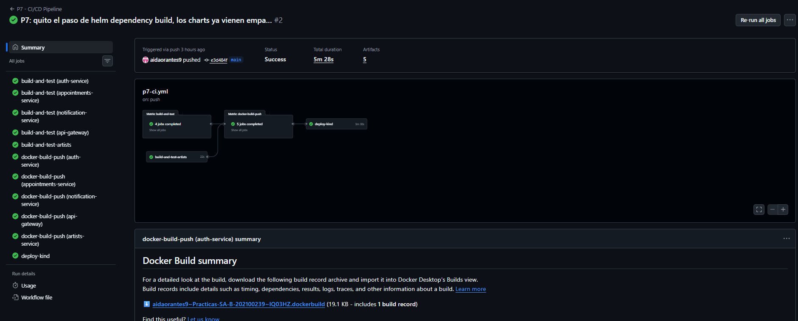
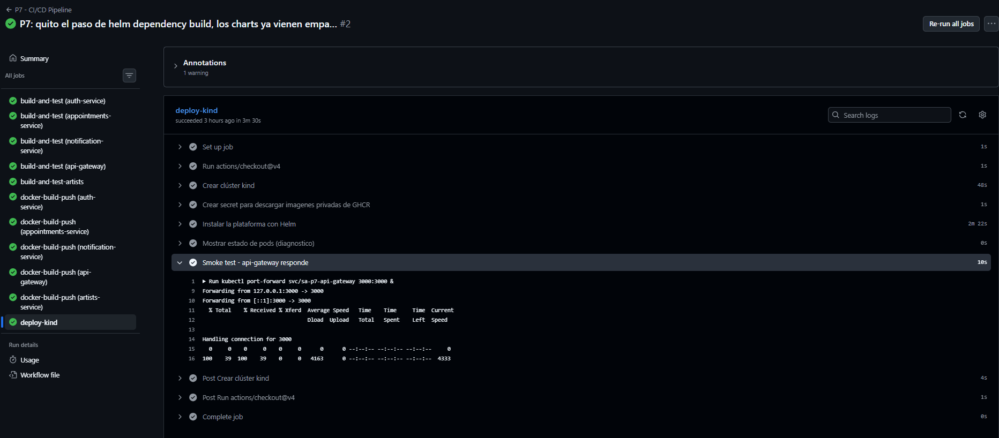
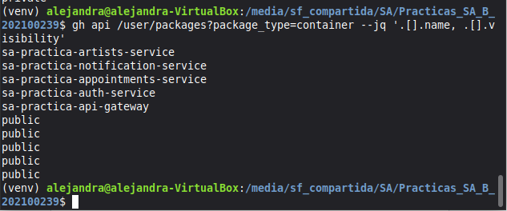

# Práctica 7 — Integración y Despliegue Continuo (CI/CD)

Pipeline de CI/CD para la plataforma de microservicios del estudio de tatuajes (Práctica 4), implementado con GitHub Actions.

## 1. Descripción del pipeline

El pipeline se dispara automáticamente con cada `push` a la rama `main` y ejecuta 4 etapas: pruebas automatizadas, construcción y publicación de imágenes Docker, y despliegue automático en un clúster de Kubernetes efímero, con verificación de funcionamiento al final.

Archivo del workflow: [`.github/workflows/p7-ci.yml`](../.github/workflows/p7-ci.yml)

## 2. Diagrama del pipeline

El diagrama muestra el flujo completo: yo hago push a `main`, GitHub Actions dispara el workflow, se ejecutan las pruebas de los 5 microservicios en paralelo, se construyen y publican las imágenes en GHCR, y finalmente se despliega todo en un clúster kind efímero, donde un smoke test verifica que el sistema responde antes de dar el pipeline por exitoso.

## 3. Etapas del pipeline

**Etapa 1 — Build & Test (`build-and-test` y `build-and-test-artists`)**
Se ejecutan en paralelo mediante una matriz de GitHub Actions, una por cada uno de los 5 microservicios. Para los 4 servicios en Node.js se instalan las dependencias con `npm install` y se corren las pruebas unitarias con `npm test` (Jest). Para el servicio de Artists en Python se instalan las dependencias con `pip` y se corren las pruebas con `pytest`.

**Etapa 2 — Build & Push de imágenes Docker (`docker-build-push`)**
Una vez que las pruebas pasan, se construye la imagen Docker de cada uno de los 5 servicios y se publica en GitHub Container Registry (GHCR), etiquetada con el SHA del commit (`ghcr.io/aidaorantes9/sa-practica-<servicio>:<sha>`). Esto asegura trazabilidad: cada imagen queda ligada a la versión exacta del código que la generó.

**Etapa 3 — Despliegue automático (`deploy-kind`)**
Se crea un clúster de Kubernetes efímero con `kind`, dentro del mismo runner de GitHub Actions. Se genera un secret para autenticar el pull de las imágenes desde GHCR, y se instala la plataforma completa (los 5 microservicios más PostgreSQL y RabbitMQ) usando el Helm chart de la Práctica 5, apuntando cada servicio a la imagen recién publicada.

**Etapa 4 — Verificación (smoke test)**
Como parte del mismo job de despliegue, se hace `port-forward` al API Gateway y se verifica con `curl` que el endpoint `/health` responda correctamente, confirmando que el despliegue automático funcionó de punta a punta.

## 4. Evidencia de ejecución exitosa

Run exitoso en GitHub Actions: [https://github.com/aidaorantes9/Practicas-SA-B-202100239/actions/runs/35113370896](https://github.com/aidaorantes9/Practicas-SA-B-202100239/actions/runs/35113370896)

Vista general del run: los 4 jobs completados con éxito (`build-and-test` en matriz de 4 servicios, `build-and-test-artists`, `docker-build-push` en matriz de 5 servicios, y `deploy-kind`), con una duración total de 5 minutos 28 segundos.

Detalle del job `deploy-kind`, mostrando el paso final "Smoke test - api-gateway responde": el `curl` al endpoint `/health` del API Gateway, ya desplegado dentro del clúster kind, completa exitosamente.

Confirmación de que las 5 imágenes publicadas por el pipeline (`sa-practica-auth-service`, `sa-practica-appointments-service`, `sa-practica-notification-service`, `sa-practica-api-gateway`, `sa-practica-artists-service`) quedaron con visibilidad pública en GHCR, cumpliendo el requisito de un registry público.

## 5. Organización del repositorio

- El código de los 5 microservicios (incluyendo las pruebas agregadas para esta práctica) vive en `P4/<servicio>/`, sin modificar la lógica de negocio.
- El Helm chart reutilizado para el despliegue vive en `P5/charts/sa-platform/`.
- El workflow de CI/CD vive en `.github/workflows/p7-ci.yml`, la ubicación estándar que reconoce GitHub Actions.
- Esta carpeta (`P7/`) contiene únicamente la documentación y las imágenes de esta práctica.
