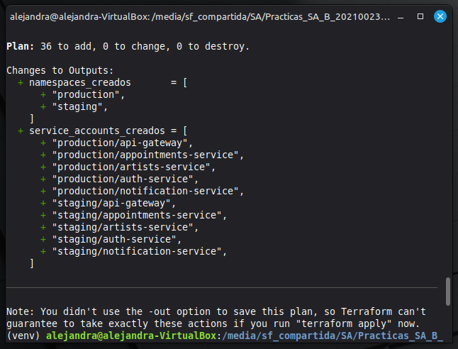
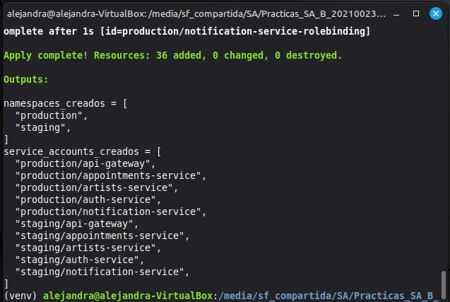
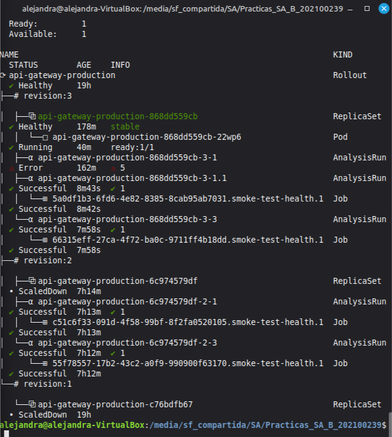
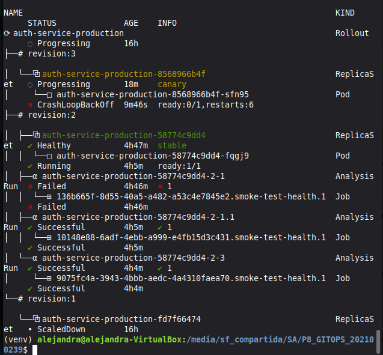
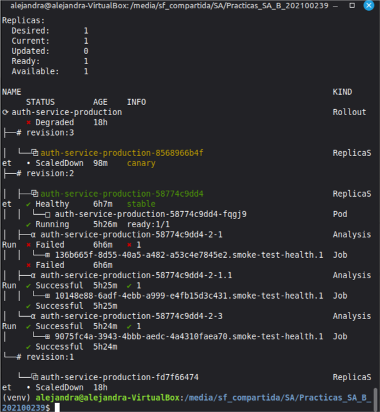
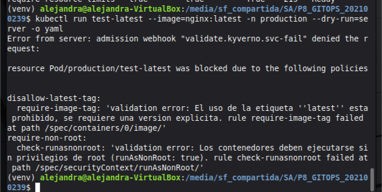
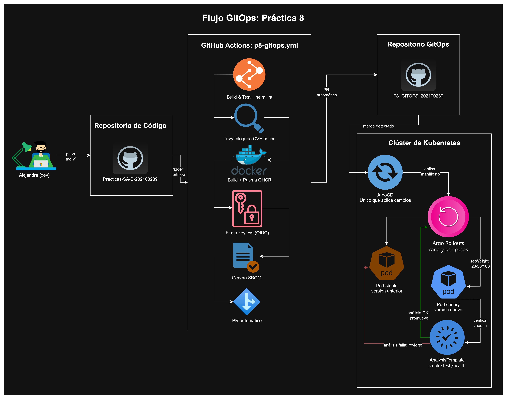

# Práctica 8 — GitOps, entrega progresiva y seguridad de la cadena de suministro

## 1. Descripción general

Esta práctica evoluciona el pipeline de CI/CD de la Práctica 7 hacia un modelo GitOps completo: el repositorio de código nunca despliega directamente al clúster. El pipeline construye, prueba, escanea y firma las imágenes, y abre un Pull Request automático a un repositorio de manifiestos independiente. **ArgoCD** es el único componente que aplica cambios al clúster, y **Argo Rollouts** ejecuta la entrega progresiva (canary) condicionada al resultado de un análisis automatizado.

- Repositorio de código: [Practicas-SA-B-202100239](https://github.com/aidaorantes9/Practicas-SA-B-202100239)
- Repositorio de manifiestos GitOps: [P8_GITOPS_202100239](https://github.com/aidaorantes9/P8_GITOPS_202100239)

## 2. Infraestructura como código (Terraform)

Namespaces (`staging`, `production`), ResourceQuota, LimitRange, ServiceAccounts y RBAC de mínimo privilegio, declarado en [`P8/terraform/`](terraform/).

## 3. Empaquetado con Helm

El chart de la Práctica 5 ([`P5/charts/sa-platform/`](../P5/charts/sa-platform/)) se adaptó para esta práctica:
- Cada uno de los 5 microservicios usa `Rollout` (Argo Rollouts) en vez de `Deployment`, con estrategia canary de 3 pasos de promoción (`setWeight: 20 → analysis → setWeight: 50 → analysis → setWeight: 100`).
- Cada servicio tiene su propio `AnalysisTemplate`, que ejecuta un smoke test real contra `/health`.
- El chart puede instalarse completo (como en la Práctica 7) o solo como infraestructura compartida, habilitando/deshabilitando cada servicio individualmente vía `<servicio>.enabled`.
- Validado con `helm lint --with-subcharts`.

## 4. GitOps con ArgoCD

10 `Application` (uno por servicio y ambiente) más `Application` de infraestructura compartida, gestión de secretos, y políticas de Kyverno, todos en [`P8_GITOPS_202100239/argocd/`](https://github.com/aidaorantes9/P8_GITOPS_202100239/tree/main/argocd).

## 5. Pipeline CI/CD ([`p8-gitops.yml`](../.github/workflows/p8-gitops.yml))

Build → test → `helm lint` → Trivy (bloquea CVE críticas) → build y push de la imagen a GHCR → firma con Cosign (keyless, identidad OIDC de GitHub Actions) → SBOM → Pull Request automático al repositorio GitOps con `peter-evans/create-pull-request`.

**Evidencia de ejecución exitosa:** [run #35292983668](https://github.com/aidaorantes9/Practicas-SA-B-202100239/actions/runs/35292983668) (tag `v0.1.5`).

## 6. Gestión de secretos

Sealed Secrets: los secretos de la aplicación (credenciales de base de datos, JWT, claves de cifrado) están sellados con `kubeseal` y viven en [`P8_GITOPS_202100239/secrets/`](https://github.com/aidaorantes9/P8_GITOPS_202100239/tree/main/secrets) como `SealedSecret`, nunca en texto plano.

## 7. Entrega progresiva y reversión automática

Se indujo deliberadamente un fallo en `auth-service` (endpoint `/health` devolviendo 500) para demostrar la reversión automática. Detalle completo en [`incidente.md`](incidente.md).

## 8. Cadena de suministro y políticas (Kyverno)

Tres políticas obligatorias activas en el clúster, gestionadas vía ArgoCD desde [`P8_GITOPS_202100239/policies/`](https://github.com/aidaorantes9/P8_GITOPS_202100239/tree/main/policies):
- `disallow-latest-tag`: prohíbe la etiqueta `latest`.
- `require-resource-limits`: exige límites de CPU y memoria.
- `require-non-root`: exige ejecución sin privilegios de root.

## 9. Informe de incidente

Ver [`incidente.md`](incidente.md).

## Diagrama del flujo GitOps

## Tabla de enlaces obligatoria

| Ítem | Enlace o dato |
|---|---|
| Repositorio GitOps | https://github.com/aidaorantes9/P8_GITOPS_202100239 |
| Aplicación en ArgoCD | `auth-service-production`, namespace `production` |
| Ejecución exitosa del pipeline | https://github.com/aidaorantes9/Practicas-SA-B-202100239/actions/runs/35292983668 |
| Reversión automática | https://github.com/aidaorantes9/Practicas-SA-B-202100239/actions/runs/35381451562 (tag `v0.1.6`), ver [`docs/fallo-inducido-reversion.png`](docs/fallo-inducido-reversion.png) |
| Despliegue rechazado por política | Ver [`docs/despliegue-rechazado-kyverno.png`](docs/despliegue-rechazado-kyverno.png) |
| Bloqueo por vulnerabilidad crítica | Corregido en los tags `v0.1.2`, `v0.1.3` y `v0.1.4`, ver historial de [Actions](https://github.com/aidaorantes9/Practicas-SA-B-202100239/actions/workflows/p8-gitops.yml) |
| Imagen firmada | `ghcr.io/aidaorantes9/sa-practica-auth-service:v0.1.5` |
| Reporte de prueba de carga | No aplica — el auxiliar indicó en el foro del curso que esta sección queda anulada para P8 |
| Video demostrativo | https://drive.google.com/drive/folders/1mUooPvAoX-iW_HNugKlVhRjbObBHF5vU?usp=sharing |
